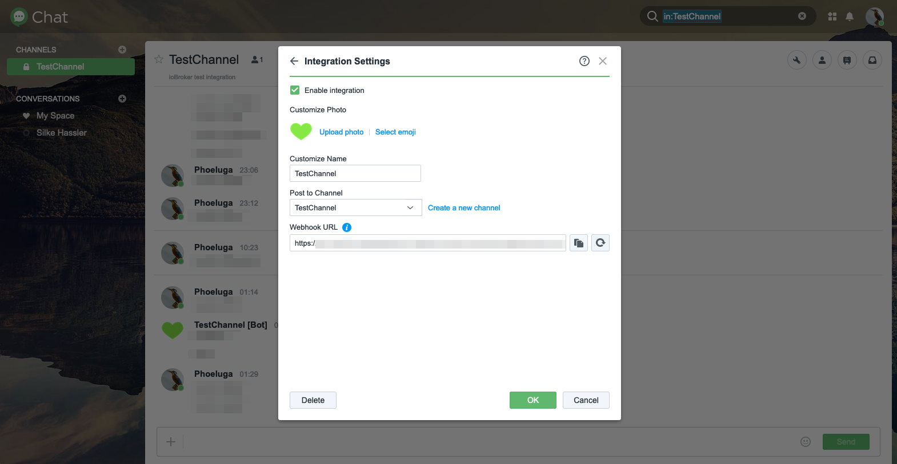
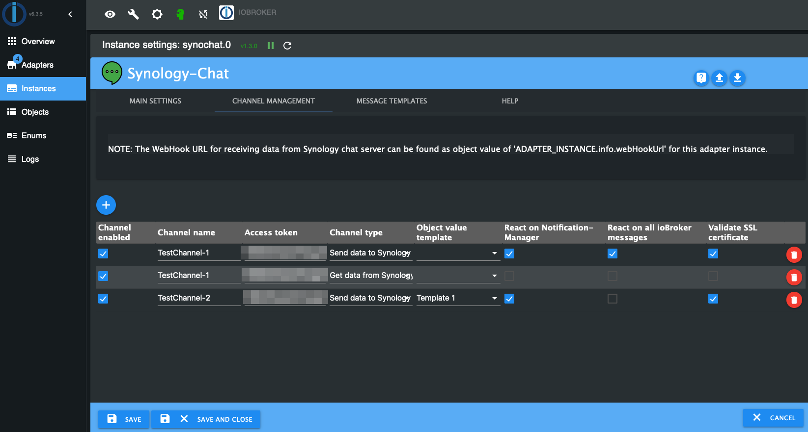

#  Synology-Chat adapter for ioBroker

## What's this?
This adapter provides an interface between Synology Chat and ioBroker.
For this purpose, the standard integration features provided by Synology Chat and the corresponding REST API endpoints are used.

---

# Manual

## 1. Installation
The adapter can be instanciated from the adapter section in your ioBroker installation.
More information can be found in the offical ioBroker documentation [HERE](https://www.iobroker.net/#de/documentation/admin/adapter.md)

## 2. Configuration
***NOTE:***\
*The perspective of the direction of incoming or outgoing messages mentioned below is considered from the point of view of the Synology chat server. For example, selecting 'Incoming' in the channel type configuration means that the messages will be sent to the Synology chat.*
### 2.1. Synology chat configuration
Synology Chat offers the possibility to handle incoming and outgoing messages. In the following, both options will be examined in more detail.

Please note that at the time of the initial release, there may be some limitations. You will find more details in the sections [Changelog](#changelog) and [Planned features](#planned-features).

To create messages via the Synology Chat interface, an integration must be created in Synology Chat:

* **Incoming Webhooks**
  
	For the integration of an incoming message in the Synology chat, a token is needed, which can be taken from the URL generated during the creation.
	
	

* **Outgoing Webhooks**\
	You will find more details in the sections [Changelog](#changelog) and [Planned features](#planned-features).

For more details on how to handle integrations within Synlogy chat, please refer to Synlogy's official documentation [HERE](https://kb.synology.com/DSM/help/Chat/chat_integration)

### 2.2. ioBroker adapter instance configuration
- The configuration of this adapter can be done in the instance settings.
    #### 2.2.1. General setup:
	
    
	* **Synology URL/IP**

        With this property a URL to your Synology-Chat app will be provided. Please note to use an absolute URL including `http://` or `https://` and do not provide an postfix like `/`.
		A specific port can be provided as usual behind the URL using `:`.

		***Sample for valide values:***
		- https://mychat.mydomain.tld
		- https://192.168.1.1:8080"

    * **Validate SSL certificate**

        It's of cause always recommended to encrypt data transfers using SSL/TLS.
		In the most cases at a home environmnet a self signed certificat is used for an SSL connection. In this case it might be neccessarry to disable the SSL certificat validation of a HTTP connection.
		Disablt to property to ignore a certification issue.

    #### 2.2.2. Channel configuration:	
	

    * **Channel name**

		This setting specifies the name of the channel from/to which messages are sent. This name can be freely selected and is used for referencing.

	* **Channel token**

		This setting provides the access token to the Synology chat channel. Depending on the channel type, the creation of this varies.
		More details can be found in chapter [Synology chat configuration](#synology-chat-configuration).

		***NOTE:***\
		*Depending on the integration, when you create the Synology chat integration, you will get a link similar to the following example:*\

			https://mychat.mydomain.tld/webapi/entry.cgi?api=SYNO.Chat.External&method=incoming&version=2&token=%22QF5DWyG7M47Ls3cv%22
		
		*In this example, the token is included in the URL. In this case, coded control characters are specified here at the beginning and end of the setting. **These have to be removed!**
		In this example the token to be entered would be `QF5DWyG7M47Ls3cv`.*
		
	* **Channel type**

		This setting specifies the type of Synology chat channel that will be used depending on the integration selected in Synology chat.

		***NOTE:***\
		*The channel type must be specified from the perspective of the Synology chat. For example, selecting 'Incoming' in the configuration means that the messages will be sent to the Synology chat.*

	#### 2.2.3. Help:
   	* This tab usually redirects to the official GitHub page of this project, where detailed help and usage instructions are given.
	* If there are any open questions, suggestions for changes, unwanted behavior or bugs, please create a [GitHub issue](https://github.com/phoeluga/ioBroker.synochat/issues/new/choose) to ensure the quality of this project.

## 3. Usage

* After the adapter is instantiated, a respective folder is created in the objects of the respective adapter instance for the Synology chat channel specified in the instance configuration.
	

* In this folder a message object can be found, which represents the sent or received message.
  
  ***NOTE:***\
	*When sending a message or when the message object is changed by the user, make sure that the Ack flag is not set. The Ack flag is set by the adapter after confirmation of successful receipt of the message by the Synology chat server.\
	**If the Ack flag is set by the user when changing, the message will not be forwarded!***
		
	

* When the message object is changed, this message - depending on the channel type - is passed to the Synology chat in the channel published.
	

---

## Changelog
All changes to this project are described in the [CHANGELOG](./CHANGELOG.md).
### Planned features:
- Outgoing message implementation

	***NOTE:***
	*The channel type must be specified from the perspective of the Synology chat. For example, selecting 'Incoming' in the configuration means that the messages will be sent to the Synology chat.*

## License
This code is licensed under the license specified in the [LICENSE](./LICENSE) file.

## Other disclosures
#### Resource attribution
- [Chat icons created by Pixel perfect - Flaticon](https://www.flaticon.com/free-icons/chat)
